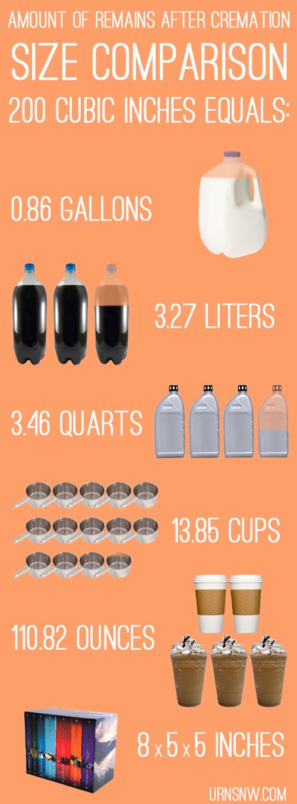

# facts

An average human body takes from two to three hours to burn completely and will produce an average of 3 to 9 pounds of ash. The amount of ash depends on the bone structure of the human body and not so much on their weight.

Cremation urn capacity is also measured in cubic inches. Most standard adult urns have a capacity of 200 cubic inches, while "companion urns," which are designed for two people, generally have a capacity of 400 cubic inches.

Other sizes are also available depending on your needs: child, infant, pet, and sharing keepsake urns are several popular options that come in a range of sizes from 1 cubic inch up to 200 cubic inches.

Overall, the simple formula of 1 lbs body weight to 1 cubic inch of remains is the simplest method to get an accurate gauge of how much remains there will be after cremation. If the person is extremely thin or overweight, using a "healthy body weight" chart will help you get a pretty accurate idea of the amount of ashes.

### 5. SHARING AMONG FAMILY & FRIENDS

- Shared using cremation jewelry
- Shared using **[small keepsake cremation urns](http://urnsnw.com/keepsake-urns/)**
- This helps with scattering/burial at different locations
- This allows family members to use different disposition methods

### 6. COMBINATION

- You can divide the ashes into two or a hundred parts, and use as many methods/locations as you want
- You can choose to scatter/bury/plant/etc over time
- You can involve as many people as you want, or conduct separate 'services' to make travel easier

### 1. GROUND BURIAL

- At a local cemetery
- At your church's cemetery
- At a veteran's cemetery (**[here is a list from the NCA](http://www.cem.va.gov/cems/listcem.asp)**)
- At a Green Burial Ground (see locations **[here](http://greenburialcouncil.org/find-a-provider/)**)
- On private property
- On your own property
- Planted as a **[memorial tree](http://www.usurnsonline.com/memorials-2/memorial-tree-urns/)**

### 2. STORAGE IN A NICHE

- Stored in a niche in a **[mausoleum](https://www.usurnsonline.com/burial/what-is-a-mausoleum/)**
- Stored in a niche in a **[columbarium](https://www.usurnsonline.com/cremation-urns/what-is-a-columbarium-niche/)** (an above-ground structure with niches that store the cremated remains)
- Outdoor niche (usually at a church or cemetery garden)

### 3. KEPT IN YOUR HOME

- In the container you receive them in
- In a **[unique cremation urn](http://urnsnw.com/cremation-urns/)**
- Made into something completely unique, **[like a hourglass, teddy bear, tattoo, etc](http://www.usurnsonline.com/oddbits/27-things-to-do-with-cremated-remains/)**

### 4. SCATTERING

- Scattered on land:
    - Poured using a **[scattering urn](http://urnsnw.com/scattering-urns-for-pouring/)**
    - Raked into the ground (very soothing; ideal for gardens)
    - Scattered at a **[meaningful location](http://www.usurnsonline.com/final-arrangements/three-great-places-scatter-ashes-loved-one/)**
    - Public land (hiking trail, park)
    - Scattered in water:
        - At sea, in a river, at a lake
        - Poured using a **[scattering urn](http://urnsnw.com/scattering-urns-for-pouring/)**
        - Dispersed using a **[biodegradable water scattering urn](http://urnsnw.com/water-scattering-urns/)**
        - Hire a boat (this affords more privacy)
        - Scattered into the ocean at a beach
    - Scattered from the air:
        - Hire a small plane or helicopter
        - Scattered from a mountaintop or cliff edge
        - Scattered using a drone service

Cremation ashes are made of crushed bone fragments. The cremation process applies extreme heat (1500-1800 degrees Fahrenheit) to the decedent's body, incinerating everything except the bones. Once the cremation chamber cools down, the bones are removed from the retort and pulverized. The resulting material is sometimes called "ash" but in reality is more like a coarse, pebbly sand.

---

In individualist cultures, death symbolises an abrupt disruption – the end of life, whereas according to clinical criteria it signifies the irreversible cessation of all vital functions
of an organism, marking the inescapable final stage of individual existence. In
many cultures, death is perceived as a transition from one state of being to
another, an intermediary stage in the endless process of transformations and
alterations.