# Sorting

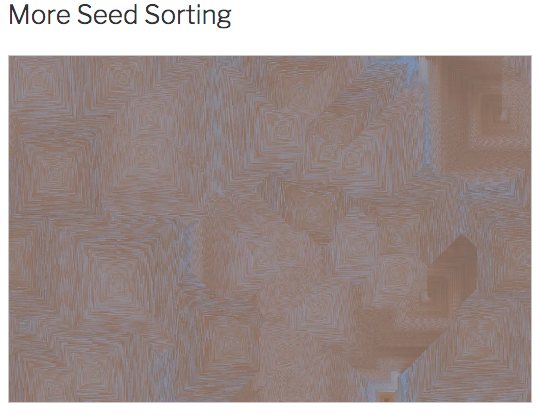

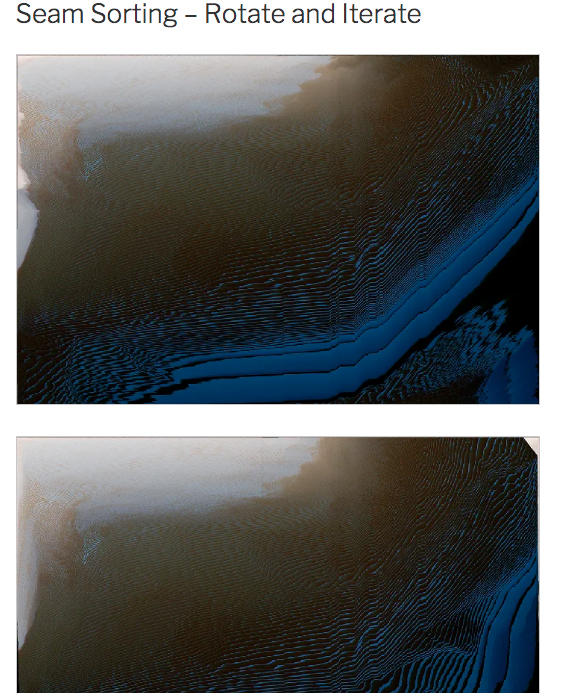

[jeffThompson/PixelSorting](https://github.com/jeffThompson/PixelSorting)

sketches>>>

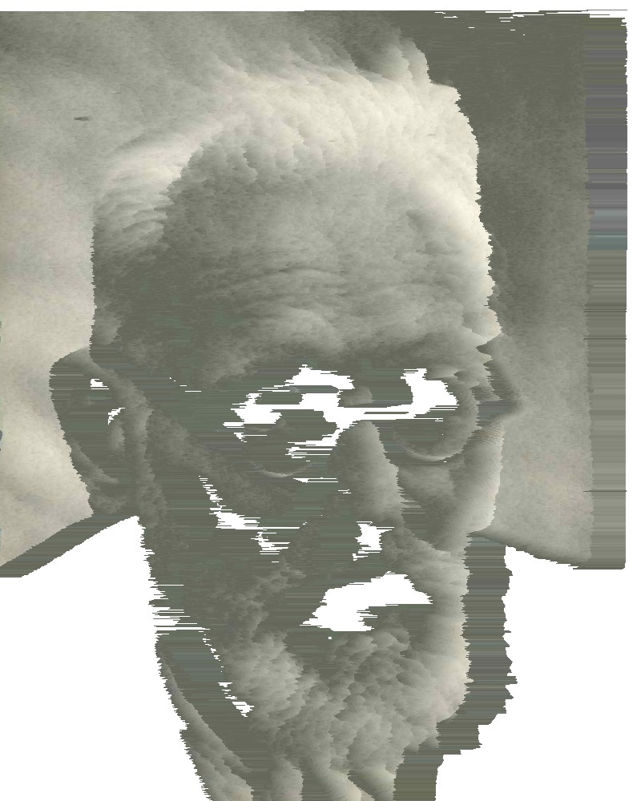

different example - kinda same result

    /*
    SORT IMAGE BY N PIXEL SEGMENTS
    Jeff Thompson | 2012 | [www.jeffreythompson.org](http://www.jeffreythompson.org/)

    Loads an image and sorts pixels in chunks of N pixels. Wraps
    pixels across image.

    */

    String filename = "Portrait.jpeg";
    boolean saveIt = false;
    boolean saveAll = true;
    int numPx = 5;
    PImage img;

    void setup() {

    img = loadImage(filename);
    img.resize(width, 0);
    size(500, 700);
    image(img, 0,0);
    }

    void draw() {

    if (saveAll) {
    println("Saving lots of tacos...");
    for (int i=2; i<2000; i++) {
    println(" " + i);
    img = loadImage("124670002.jpg");
    sortNpx(i);
    image(img, 0, 0);
    save("200Tacos/" + nf(i, 4) + ".png");
    }
    println("DONE!");
    exit();
    }
    else {
    sortNpx(numPx);
    image(img, 0, 0);
    }
    }

    // strip file extension for saving and renaming
    String stripFileExtension(String s) {
    s = s.substring(s.lastIndexOf('/')+1, s.length());
    s = s.substring(s.lastIndexOf('\\')+1, s.length());
    s = s.substring(0, s.lastIndexOf('.'));
    return s;
    }

    void mouseDragged() {
    img = loadImage("net.jpeg");
    img.resize(width, 0);
    numPx = int(map(mouseX, 0, width, 5, 100));
    }

    void mouseReleased() {
    if (saveIt) {
    filename = stripFileExtension(filename);
    save("results/SortNpx_" + filename + "_" + numPx + ".tiff");
    }
    }

    void sortNpx(int numPx) {
    img.loadPixels();
    for (int i=0; i>

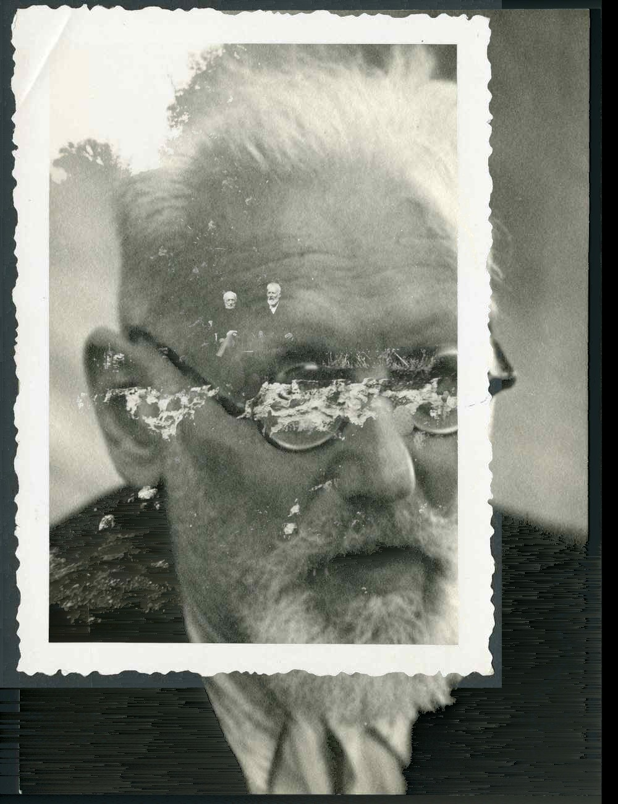

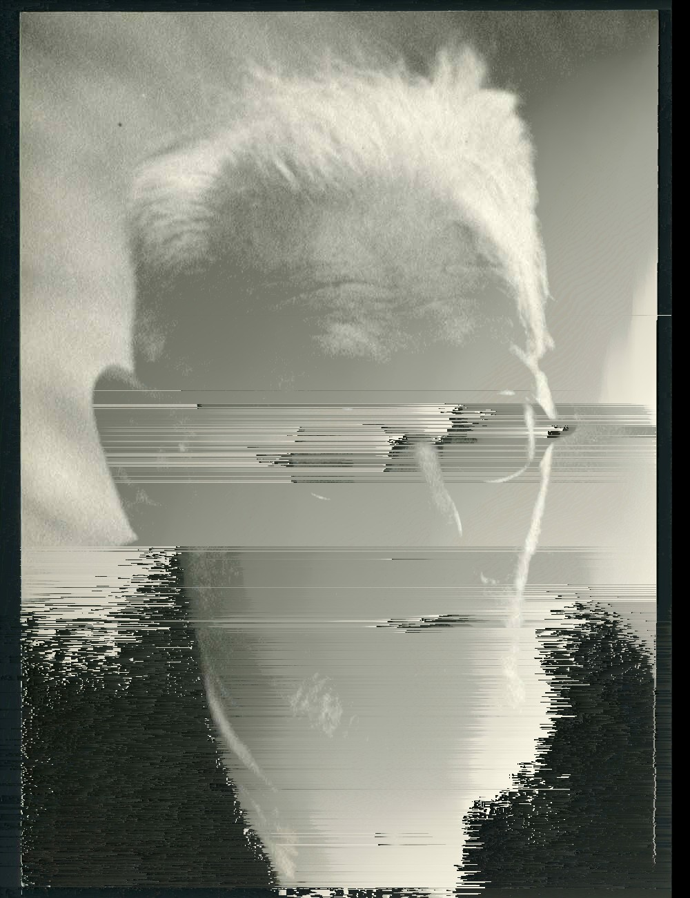

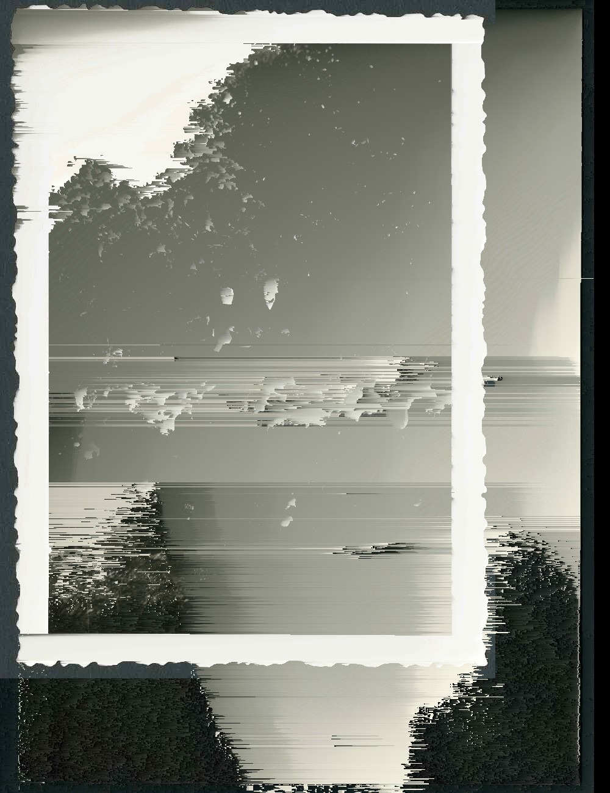

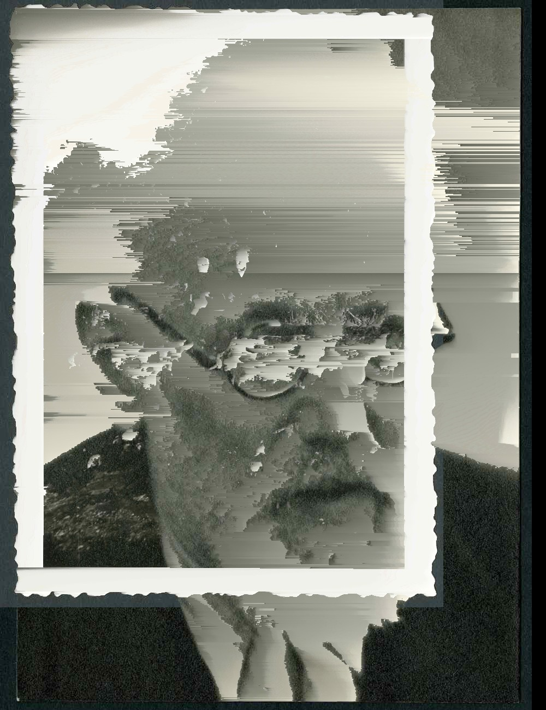

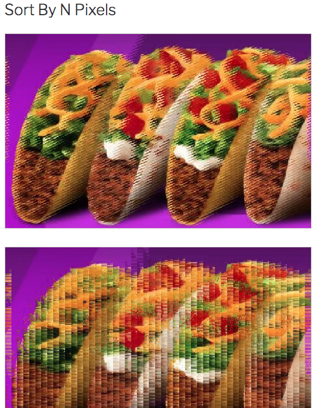

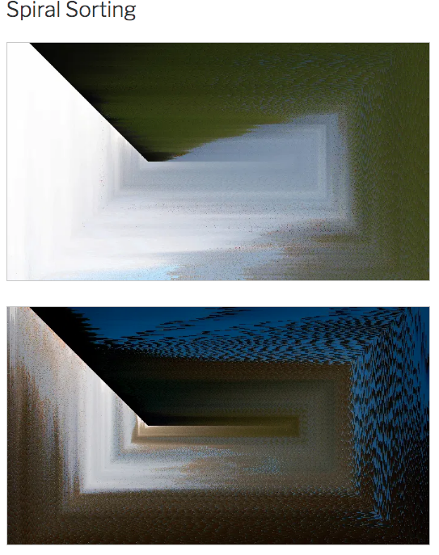

    PImage img;

    void setup() {
    img = loadImage("Portrait.jpeg");
    img.resize(width, 0);//change this to whatever the file name of your image is
    size(800,1000);
    }

    void draw() {
    background(255);
    loadPixels();
    for (int y = 0; y<height; y+=1 ) {
    for (int x = 0; x<width; x+=1) {
    int loc = x + y*img.width;
    float r = red (img.pixels[loc]);
    float g = green (img.pixels[loc]);
    float b = blue (img.pixels[loc]);
    float av = ((r+g+b)/3.0);

    pushMatrix();
    translate(x,y);
      stroke(r,g,b);
      if (r > 100 && r < 255) {
        line(0,0,(av-255)/3,0); //change these values to alter the length. The closer to 0 the longer the lines. 
       // you can also try different shapes or even bezier curves instead of line();
      }
    popMatrix(); 
      
    }

    }
    println("done");
    noLoop();
    }

    void keyPressed() {
    if (key == ' ') {
    saveFrame(millis() + "####.jpg");
    }
    }

SortImageByNpx

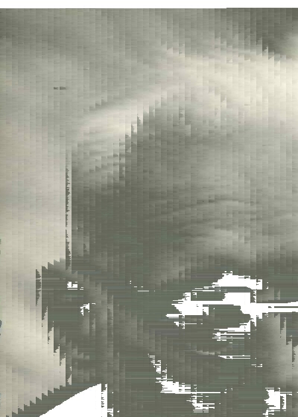

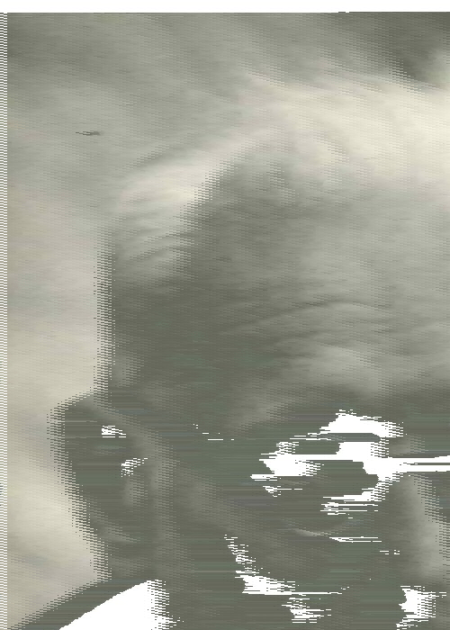

    /*
    ASDF Pixel Sort
    Kim Asendorf | 2010 | [kimasendorf.com](http://kimasendorf.com/)

    sorting modes

    0 = black
    1 = brightness
    2 = white

    */

    int mode = 1;

    // image path is relative to sketch directory
    PImage img;
    String imgFileName = "Portrait";
    String fileType = "jpeg";

    int loops = 5;

    // threshold values to determine sorting start and end pixels
    int blackValue = -16000000;
    int brightnessValue = 60;
    int whiteValue = -13000000;

    int row = 0;
    int column = 0;

    boolean saved = false;

    void setup() {
    img = loadImage(imgFileName+"."+fileType);

    // use only numbers (not variables) for the size() command, Processing 3
    size(1, 1);

    // allow resize and update surface to image dimensions
    surface.setResizable(true);
    surface.setSize(500, 650);

    // load image onto surface - scale to the available width,height for display
    image(img, 0, 0, width, height);
    }

    void draw() {

    // loop through columns
    while(column < img.width-1) {
    println("Sorting Column " + column);
    img.loadPixels();
    sortColumn();
    column++;
    img.updatePixels();
    }

    // loop through rows
    while(row < img.height-1) {
    println("Sorting Row " + column);
    img.loadPixels();
    sortRow();
    row++;
    img.updatePixels();
    }

    // load updated image onto surface and scale to fit the display width,height
    image(img, 0, 0, width, height);

    if(!saved && frameCount >= loops) {

    // save img
    img.save(imgFileName+"_"+mode+".png");

    saved = true;
    println("Saved "+frameCount+" Frame(s)");
    
    // exiting here can interrupt file save, wait for user to trigger exit
    println("Click or press any key to exit...");

    }
    }

    void keyPressed() {
    if(saved)
    {
    System.exit(0);
    }
    }

    void mouseClicked() {
    if(saved)
    {
    System.exit(0);
    }
    }

    void sortRow() {
    // current row
    int y = row;

    // where to start sorting
    int x = 0;

    // where to stop sorting
    int xend = 0;

    while(xend < img.width-1) {
    switch(mode) {
    case 0:
    x = getFirstNotBlackX(x, y);
    xend = getNextBlackX(x, y);
    break;
    case 1:
    x = getFirstBrightX(x, y);
    xend = getNextDarkX(x, y);
    break;
    case 2:
    x = getFirstNotWhiteX(x, y);
    xend = getNextWhiteX(x, y);
    break;
    default:
    break;
    }

    if(x < 0) break;
    
    int sortLength = xend-x;
    
    color[] unsorted = new color[sortLength];
    color[] sorted = new color[sortLength];
    
    for(int i=0; i<sortLength; i++) {
      unsorted[i] = img.pixels[x + i + y * img.width];
    }
    
    sorted = sort(unsorted);
    
    for(int i=0; i<sortLength; i++) {
      img.pixels[x + i + y * img.width] = sorted[i];      
    }
    
    x = xend+1;

    }
    }

    void sortColumn() {
    // current column
    int x = column;

    // where to start sorting
    int y = 0;

    // where to stop sorting
    int yend = 0;

    while(yend < img.height-1) {
    switch(mode) {
    case 0:
    y = getFirstNotBlackY(x, y);
    yend = getNextBlackY(x, y);
    break;
    case 1:
    y = getFirstBrightY(x, y);
    yend = getNextDarkY(x, y);
    break;
    case 2:
    y = getFirstNotWhiteY(x, y);
    yend = getNextWhiteY(x, y);
    break;
    default:
    break;
    }

    if(y < 0) break;
    
    int sortLength = yend-y;
    
    color[] unsorted = new color[sortLength];
    color[] sorted = new color[sortLength];
    
    for(int i=0; i<sortLength; i++) {
      unsorted[i] = img.pixels[x + (y+i) * img.width];
    }
    
    sorted = sort(unsorted);
    
    for(int i=0; i<sortLength; i++) {
      img.pixels[x + (y+i) * img.width] = sorted[i];
    }
    
    y = yend+1;

    }
    }

    // black x
    int getFirstNotBlackX(int x, int y) {

    while(img.pixels[x + y * img.width] < blackValue) {
    x++;
    if(x >= img.width)
    return -1;
    }

    return x;
    }

    int getNextBlackX(int x, int y) {
    x++;

    while(img.pixels[x + y * img.width] > blackValue) {
    x++;
    if(x >= img.width)
    return img.width-1;
    }

    return x-1;
    }

    // brightness x
    int getFirstBrightX(int x, int y) {

    while(brightness(img.pixels[x + y * img.width]) < brightnessValue) {
    x++;
    if(x >= img.width)
    return -1;
    }

    return x;
    }

    int getNextDarkX(int _x, int _y) {
    int x = _x+1;
    int y = _y;

    while(brightness(img.pixels[x + y * img.width]) > brightnessValue) {
    x++;
    if(x >= img.width) return img.width-1;
    }
    return x-1;
    }

    // white x
    int getFirstNotWhiteX(int x, int y) {

    while(img.pixels[x + y * img.width] > whiteValue) {
    x++;
    if(x >= img.width)
    return -1;
    }
    return x;
    }

    int getNextWhiteX(int x, int y) {
    x++;

    while(img.pixels[x + y * img.width] < whiteValue) {
    x++;
    if(x >= img.width)
    return img.width-1;
    }
    return x-1;
    }

    // black y
    int getFirstNotBlackY(int x, int y) {

    if(y < img.height) {
    while(img.pixels[x + y * img.width] < blackValue) {
    y++;
    if(y >= img.height)
    return -1;
    }
    }

    return y;
    }

    int getNextBlackY(int x, int y) {
    y++;

    if(y < img.height) {
    while(img.pixels[x + y * img.width] > blackValue) {
    y++;
    if(y >= img.height)
    return img.height-1;
    }
    }

    return y-1;
    }

    // brightness y
    int getFirstBrightY(int x, int y) {

    if(y < img.height) {
    while(brightness(img.pixels[x + y * img.width]) < brightnessValue) {
    y++;
    if(y >= img.height)
    return -1;
    }
    }

    return y;
    }

    int getNextDarkY(int x, int y) {
    y++;

    if(y < img.height) {
    while(brightness(img.pixels[x + y * img.width]) > brightnessValue) {
    y++;
    if(y >= img.height)
    return img.height-1;
    }
    }
    return y-1;
    }

    // white y
    int getFirstNotWhiteY(int x, int y) {

    if(y < img.height) {
    while(img.pixels[x + y * img.width] > whiteValue) {
    y++;
    if(y >= img.height)
    return -1;
    }
    }

    return y;
    }

    int getNextWhiteY(int x, int y) {
    y++;

    if(y < img.height) {
    while(img.pixels[x + y * img.width] < whiteValue) {
    y++;
    if(y >= img.height)
    return img.height-1;
    }
    }

    return y-1;
    }