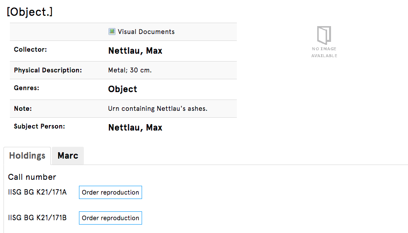

# urn

# Urn containing Nettlau's ashes.

[https://search.iisg.amsterdam/Record/1013704](https://search.iisg.amsterdam/Record/1013704)

Is archiving human ash mistake? Can we say its not ethical, not moral? Is he there by mistake? What is the difference between archiving human ash at the cemetery and at the archive of teh social institute? Max Nettlau was the collector, he was selling various things to archive, when he passed away, he didn't have anymore any family members or friends, so they put him there... 

.jpeg)